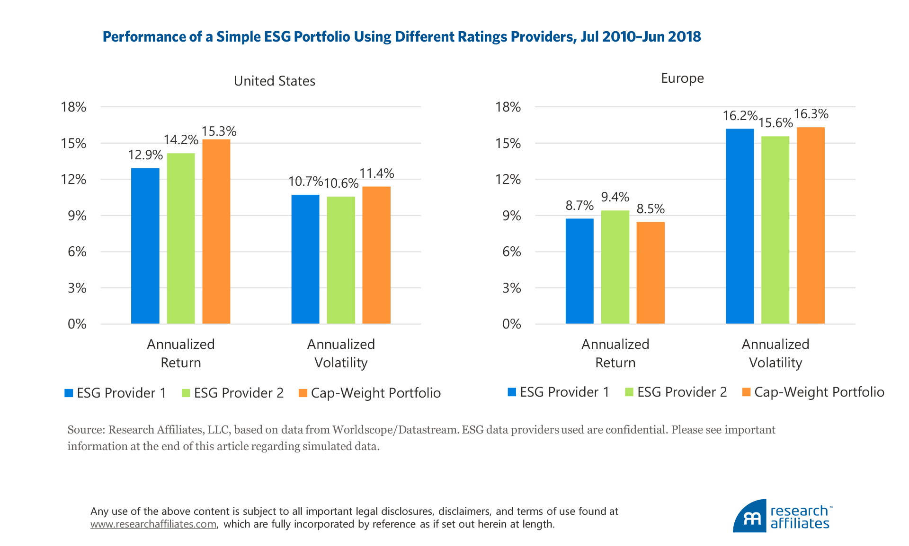
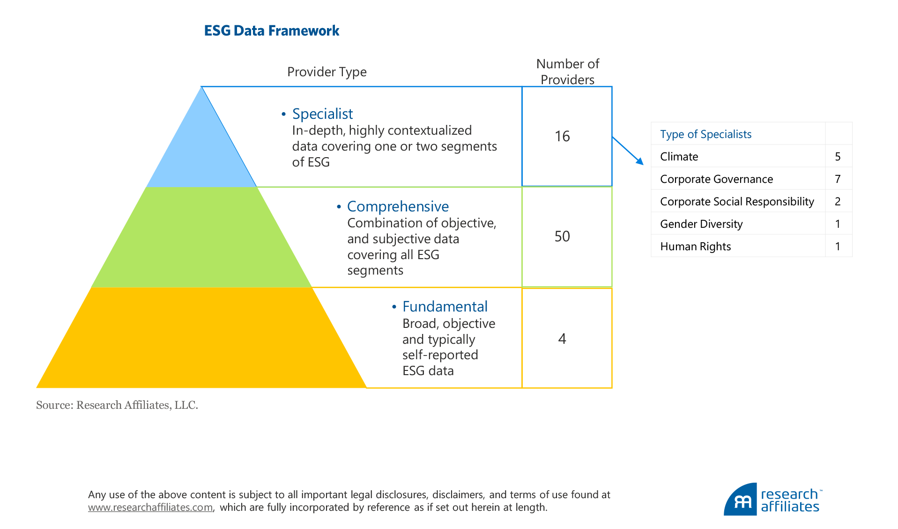

# TRUVALUE LABS Case Study

## Overview and Origin
* Name of company: 

Truvalue Labs, Inc

* When was the company incorporated?

July 18 2013

* Who are the founders of the company?
    
    
 Hendrik Bartel (CEO) and Phil Kim (CPO)

* How did the idea for the company (or project) come about?

One of the co-founders, Hendrik Bartel, participated previously in three startups in Silicon Valley. After that, and while pursuing his MBA at St. Mary's College in California, he got interested in the topic of financial data and how investment companies get access to it. In particular, he realized that in Environmental, Social, and Governance (ESG) investment data was of poor quality. As an example, data regarding the same company but provided by different sources was inconsistent. He understood that a different, more resourceful process, was required for discovering information establishing if a company had socially and environmentally responsible policies. Previous experience in other startups where technology was involved gave him the answer: Artificial Intelligence (AI) and Natural Language Processing (NLP)

* How is the company funded? How much funding have they received?

According to Crunchbase (https://www.crunchbase.com/) the total funding amount the company has raised is $13.6 million. This has been done in two funding rounds. The first one took place in November 2017 in the form of a Convertible Bond issue. The second round was a Series A that took place in May 2018. The funding status of this company is defined as "Early Stage Venture".
___
## Business Activities:

* What specific financial problem is the company or project trying to solve?

Truvalue Labs focuses in determining metrics to evaluate and quantify how much a company is involved in practicing ESG policies. This is important from the investment point of view for two reasons. First, investors (specially millennials) are increasingly abandoning the Friedman Doctrine where the only goal of a firm is to maximize returns to shareholders. Younger investors want to see their own values reflected in the practices of the companies where they want to invest. Secondly, there is increasing evidence that, in the medium and long terms, companies that implement ESG policies have better returns than companies that put a low value to their social and environmental responsibilities.

* Who is the company's intended customer? 

This is a B2B financial solutions company. Potential clients are investment professionals, asset managers, wealth managers and any financial institution responsible for managing investors money as well as providing advisory and execution services. Financial services companies have become in the last years very aware of the importance of providing ESG options to their clients. The potential base of clients for Truvalue Labs is of an enormous size. The latest report produced by the US Forum for Sustainable and Responsible Investment (US SIF), estimates that ESG investment factors for **$12 trillion** of professionally managed assets.
 
* What solution does this company offer that their competitors do not or cannot offer? 

When investment firms started showing interest in companies with strong ESG policies, a number of rating providers appear in the market trying to evaluate, qualitatively and in some cases quantitatively, how committed companies were to a sustainable ESG policy. The problems with these services (those trying to obtain information from regular channels) were several: Data was largely sourced from companies themselves, consequently ratings were dependent in the amount of disclosure that the company was willing to provide. Also, as information came from companies disclosures and financial statements, a considerable time-lag was involved. Finally, as different providers look at different measures there was a lack of consistency in the results involving the same company. This last effect can be seen in the figure below (from research published by Research Affiliates):

Two portfolios, 1 and 2, are constructed based on the ESG ratings produced by two different providers but for the same companies. The differences in ratings translate into different portfolio compositions. We can see how in the US and Europe the portfolios yield different returns and variances.

Truvalue Labs employs a different approach. Using AI and NLP, they are able to sweep multiple sources of information with tremendous amount of data in real time in search of ESG content related to a specific company. They can access reports produced by independent analysts, explore various media , and query research and reports produced by advocacy groups, government regulators and agencies. 

The capability to sweep multiples sources of information and find relevant data has allowed Truvalue Labs to create very precise indices, measuring the level of ESG governance that companies are establishing and applying to companies. At the moment they are offering 4 products and solutions available, respectively, to Asset Managers, Asset Owners, Quantitative Managers, Fixed Income Managers, and Risk and Compliance. The four products are: 
1. **Platform**: This is an integrated solution where clients have access to ESG data and analytics on intangible factors. With Platform the clients can discover unique investment themes and find opportunities that other investors might miss. It allows access to ESG alerts, material events for companies, and analyze companies using the framework for codified standards from the Sustainability Accounting Standards Board™ (SASB).
2. **Data**: One of the big advantages of Truvalue Labs over competitors is that clients can uncover new sources of alpha with this unique set of data. Investors can beat the market by developing trading strategies containing factors that produce excess return over the market. Truvalue Labs research has established that ESG factors are independent to  other pricing factors such as size of firms and book-to-market values.
3. **Cloud**: Clients can deliver the dataset and Truvalue Labs processes and analyzes it with their AI Engine. The results can be visualized with interactive charts and company scorecards.
4. **Index**: The company has built a set of index solutions that provide scoring of companies with relation to how involved they are in ESG.

* Which technologies are they currently using, and how are they implementing them?

 The two main technologies used are AI and NLP. NLP is itself a sub-field of machine learning. Diego Lopez Yse defines NLP in his text "*Your Guide to Natural Language Processing (NLP)*" as follows:

*Natural Language Processing or NLP is a field of Artificial Intelligence that gives the machines the ability to read, understand and derive meaning from human languages.*

The enhancement that NLP yields is that (thanks to its machine learning set-up) systematically provides the understanding of the **meaning** behind words and phrases. This goes beyond previous technologies where the goal was just to interpret a text or speech based on its keywords. NLP delivers a cognitive analysis of human text or speech where figurative language can be interpreted.

One of the NLP features that it's particularly useful for ESG investing is the capability to perform Sentiment Analysis (SA). SA is actually a sub-set of NLP where algorithms can identify and extract subjective information in source material to indicate the public perception of a company or a brand. With SA, Truvalue Labs can identify the public perception (by searching in social media, blogs, surveys, opinion articles and so on) of a company regarding their ESG activity. 

Python  contains the open-source package "Natural Language Toolkit" (NLTK). This is a popular toolkit built for NLP implementation. A very friendly introduction for beginners can be found at https://towardsdatascience.com/natural-language-processing-nlp-for-machine-learning-d44498845d5b
___

## Landscape:

* What domain of the financial industry is the company in?

The domain where Truvalue Labs belongs is Investment Management.

* What have been the major trends and innovations of this domain over the last 5-10 years?

Investment Management is a very wide domain where many different types of technology companies have entered this space revolutionizing the industry. It has been one of the leading domains in FinTech in the last few years. To narrow the landscape regarding Truvalue Labs, I will concentrate on financial companies providing services related to ESG investments. 

For a long time there has been a debate in economics and financial theory regarding the role of private corporations in society. At one side there is the Friedman Doctrine where the responsibility of companies resides exclusively in the maximization of shareholders capital. At the other side, some commentators and analysts consider that corporations have also a responsibility with society that goes beyond taking care only of shareholders. In the last two decades the later one, the doctrine based on responsibilities also with the environment and society, has gather many followers in the investment community. Since then, some data companies started providing analysis with the objective to identify society-responsible companies. The term "Socially Responsible Investing" (SRI) was defined back in the 1970's. At that time companies providing services to identify SRI corporations relied on exclusionary screens and filters (some mutual funds for example started excluding tobacco and  weapons manufacturing companies). 

More recently, government compliance was also added into the list of factors determining SRI, creating the term ESG. In this space providers have focused now on creating ESG "factors" to help identify companies positioned for strong long-term performance based on their ESG features. In this setup the main data source has been companies disclosures. Some other data providers have only recently adventuring into Machine Learning and AI in order to source relevant information coming from many different places.  

* What are the other major companies in this domain?
The majority of investment advisors active in the ESG space employ their own tools to select SRI companies. These actually are all potential clients for Truvalue Labs. The number of external firms providing external ESG selection services is limited. My search encountered the following:
    * RepRisk (https://www.reprisk.com/): This is probably Truvalue Labs main competitor. It is a data science company based in Zurich that employs AI as well as human intelligence to screen multiple sources. The business proposition is nonetheless different to the one developed by Truvalue Labs. RepRisk is set up more for risk management identifying SRI issues with companies constituting investment portfolios. Truvalue Labs adds value by identifying ESG as an alpha source factor independent to other quantitative pricing factors such as Value and Size.
    * Refinitiv (https://www.refinitiv.com/en): Company specialized in sourcing ESG data exclusively from official company disclosures. 
    * S&P Global (https://www.spglobal.com/en/): World leading credit rating agency. Sources public and private data and leverage the information at their disposal as the largest credit rating agency. As far as I can tell is does not employ AI or machine learning techniques to produce their ESG indices. Only traditional analysis.
    * State Street Corporation (https://www.statestreet.com/home.html): Built a scoring system that uses data from multiple providers.
    * RavenPack (https://www.ravenpack.com/): This company provides a platform that allows access to ESG events and sentiment on a sample of 50,000 companies. It is employing AI and machine learning to source data.
    * Intercontinental Exchange ICE (https://www.theice.com/index): Owner of multiple trading exchanges for financial and commodities markets all around the globe. Their ESG service provides metrics derive from companies disclosures.
    
___

## Results

* What has been the business impact of this company so far?   Truvalue Labs has won several awards in the fields of ESG investment and Financial Technology: 
    * "Best Independent House for ESG Research 2020" awarded by ESG Investment Awards. 
    * "Best AI/Machine Learning Data Initiative 2019" awarded by Inside Market Data & Inside Reference Data.
    * "Best Buyside AI Platform 2019" awarded by Buy-Side Technology.
    * "Best Data Provider Alternative Data Sources 2019" awarded by Tech & WSL Awards.
    * "Fastest Growing Fintech Startups 2019" awarded by The Fintech 250.

Additionally, companies providing investment management services in Europe and the US are starting to use products provided by Truvalue Labs. Jon Lukomik, Managing Partner at the London based firm Sinclair Capital LLC, explains for example  that *"Truvalue Labs’ daily updates help cut through the volume of daily noise seeing signals around significant developments at specific companies”*. Another example is one local government pension scheme in the U.K. called Brunel Pension Partnership (more than $30 billion in AUM). Faith Ward, Chief Responsible Investment Manager at Brunel explains:  *“Our primary objective is to enable each fund to deliver its fiduciary duty to act in the best long-term interests of our members. We evaluated a number of providers on the market and concluded that Truvalue Labs had the one that we wanted as a primary source, both for communicating with managers and for evaluating the risks in our portfolios"*. 

Truvalue Labs is also creating partnerships with other data providers that concentrate in areas outside the ESG spectrum, but that want to broad their solution's portfolio provided to clients. One of those providers is the German based firm Solactive. Truvalue Labs partnered with them since February 2019 intensifying efforts to meet a significant increase in client demand for ESG indices.    

    

* What are some of the core metrics that companies in this domain use to measure success? How is your company performing, based on these metrics?

The metric used to measure success in the investment management industry is the amount of assets under management (AUM). Unfortunately there is no data available regarding the AUM of clients using Truvalue Labs at the moment. We can nonetheless extend our landscape analysis to compare in more detail Truvalue Labs against other data providers in terms of scope of service. This at least will give us some insight into the potential for Truvalue Labs of outperforming competitors in terms of market share. The following is a figure, taken from research performed by Research Affiliates, depicting the landscape of ESG data providers in terms of type of service:

 

Research Affiliates divides the spectrum of ESG data providers into three tyres: Fundamental, Comprehensive, and Specialist. In the Fundamental category we have companies that collect and aggregate ESG data without providing much structure. Clients then use the data themselves to build indices or design strategies. Example of companies in the Fundamental group are Bloomberg and Refinitiv.

Another category is Specialist. Here providers usually concentrate in one specific component of the ESG spectrum: Environment, Social or Government. The most predominant is environment, where for example providers report the carbon print of big corporations. In the last few years others have specialized instead in aspects of the Social branch such as gender diversity and human rights.

The level in the middle is the most crowded category: Comprehensive. In this space providers not only gather data but also use their own methodology to establish ratings or indices. Truvalue Labs falls into this category. According to Research Affiliates there are 50 companies in this bracket. Of those, they report that Truvalue Labs and RepRisk stand out in terms of advanced technology used. This tells us two things. First, that Truvalue Labs is probably in the right track  regarding business model. Many other companies have identified the Comprehensive model as possibly the one adding more value. Secondly, that of all these companies Truvalue Labs (as well as RepRisk) have now a clear competitive advantage as they are already in place to leverage advances in machine learning and AI. Other competitors (probably the entire sample of 48 companies) will have to move to more advanced methods to gather data in a world where social media is more and more predominant. Under this metric I would say that Truvalue Labs is already a very successful company.  

___
## Recommendations

* If you were to advise the company, what products or services would you suggest they offer? 

Truvalue Labs has focused its business strategy in building ESG indices that provide investment companies with an alpha factor, which is independent of commonly used quantitative factors. A way to broaden the spectrum of possible clients is to focus more on the "G" part of the ESG, that is in government and regulations. Following multiple scandals in corporate America in the last years, government regulators have increased the scrutiny of practices related to financial reporting, governance, and executives pay. A next step in regulations could be to examine how well companies are behaving in the ESG field. Truvalue Labs can offer government and financial regulators, a service focusing directly on how to detect firms that have not been noticed by their regular and existing control measures.

* Why do you think that offering this product or service would benefit the company?

A high correlation between regulation compliancy and ESG indexing is expected. Companies with strong policies enhancing their footprint in social , environmental, and government aspects of their operation, are expected to also have strong controls in place that secure compliance regarding financial and market regulation. Low ESG indices can be used by regulator as red flags, and a company with a low ESG index should expect to be scrutinized. Truvalue Labs can increment their client base (by adding regulators to it) by creating specific products delivering ESG indices customized for compliance screening.

* What technologies would this additional product or service utilize?

The technology would be the same, NLP. What Truvalue Labs can do is to make resources available to increase the sweeping of media and research information related to government and regulation compliance.  They can also build indices specially designed to quantify the level of governance responsibility in companies.
___
## References
* Feifei Li and Ari Polychronopoulos, What a Difference an ESG Ratings Provider Makes!, *Research Affiliates*, 2020. https://www.researchaffiliates.com/en_us/publications/articles/what-a-difference-an-esg-ratings-provider-makes.html
* Truvalue Labs web site.
https://www.truvaluelabs.com/
* State Street Global Advisor, Article **ESG**, 2019. https://www.ssga.com/investment-topics/environmental-social-governance/2019/03/esg-data-challenge.pdf
* S&P Global, ESG Intelligence to  Power the Markets of the Future, 2019. https://www.spglobal.com/en/capabilities/spglobal-esg-intelligence-to-power-the-markets-of-the-future.pdf
* Truvalue Labs, Performance Tests of TruValue Labs Insight, ESG Momentum, and Volume Signals. Initial U.S. large cap results for the S&P 500 Stock Universe, 2013-2017. https://www.truvaluelabs.com/wp-content/uploads/2017/11/WP_PerfTest_SP500.pdf
* Diego Lopez Yse, Your Guide to Natural Language Processing (NLP), *Towards Data Science*, 2019. https://towardsdatascience.com/your-guide-to-natural-language-processing-nlp-48ea2511f6e1
* Shashank Gupta, Sentiment Analysis: Concept, Analysis and Applications, *Towards Data Science*, 2018. https://towardsdatascience.com/sentiment-analysis-concept-analysis-and-applications-6c94d6f58c17
* Badreesh Shetty, Natural Language Processing(NLP) for Machine Learning, *Towards Data Science*, 2018. https://towardsdatascience.com/natural-language-processing-nlp-for-machine-learning-d44498845d5b
* Refinitiv, ESG data wesite, http://solutions.refinitiv.com/esg-data/?utm_content=Company%20Data-US-AMER-G-EN-BMM&utm_medium=cpc&utm_source=google&utm_campaign=68832_RefinitivBAUPaidSearch&elqCampaignId=5917&utm_term=+esg&gclid=CjwKCAjw3-bzBRBhEiwAgnnLCpreozZsM2GR35DZq9U2aPeD--LlSahq1knAYoXjBEimjo1RbZ0bDRoCITcQAvD_BwE
* RepRisk website, https://www.reprisk.com/about
* Chrunchbase, https://www.crunchbase.com/organization/truvalue

